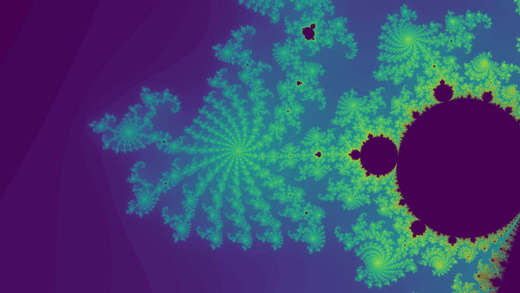
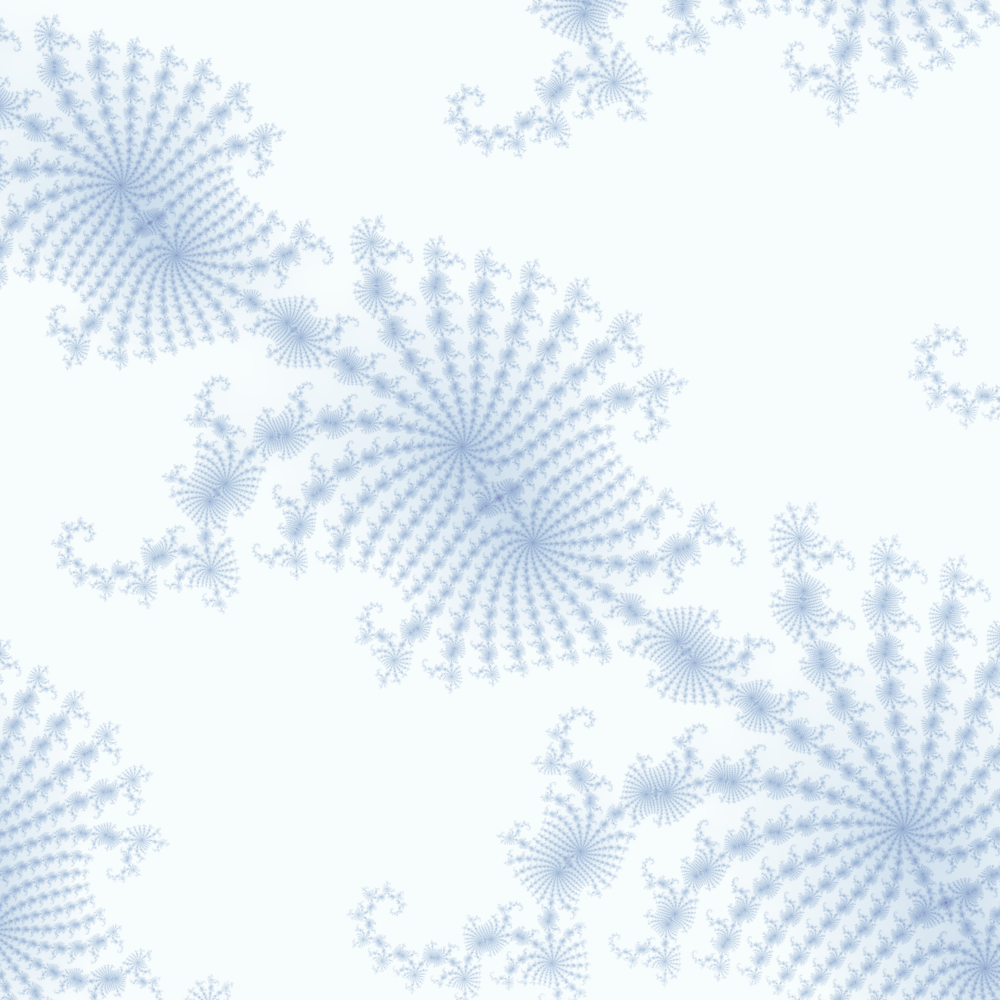

# Mandelbrot calculator
Produce beautiful fraktals with Python -- Fast with little dependencies

## Dependencies

* Python3
* numba
* numpy, matplotlib, argparse


## Examples

### 4k Background

```bash
$ time python3 mandelbrot.py -o example_bg4k.png --maxiter 1000 --saturation=8 point --point=-.736:-.2086 -R 3840x2160 -F 10
python3 mandelbrot.py -o examples/example_bg4k.png --maxiter 1000  point  -R   13,82s user 0,47s system 127% cpu 11,189 total
```
[](examples/example_bg4k.png)

### Square

```bash
$ time python3 mandelbrot.py -o example_star.png --colormap=BuPu --maxiter 2000 --coloroffset=.1 --saturation=4.3 point --point=-.7379995:-.208601 --pixel 4000 -F 10 --power 5
python3 mandelbrot.py -o example_star.png --colormap=BuPu --maxiter 2000       35,12s user 0,83s system 243% cpu 14,777 total
```
[](examples/example_star.png)
